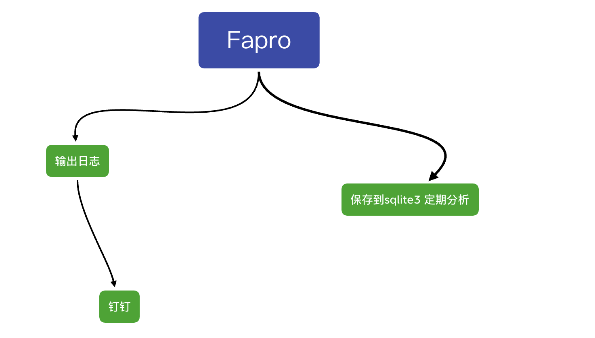
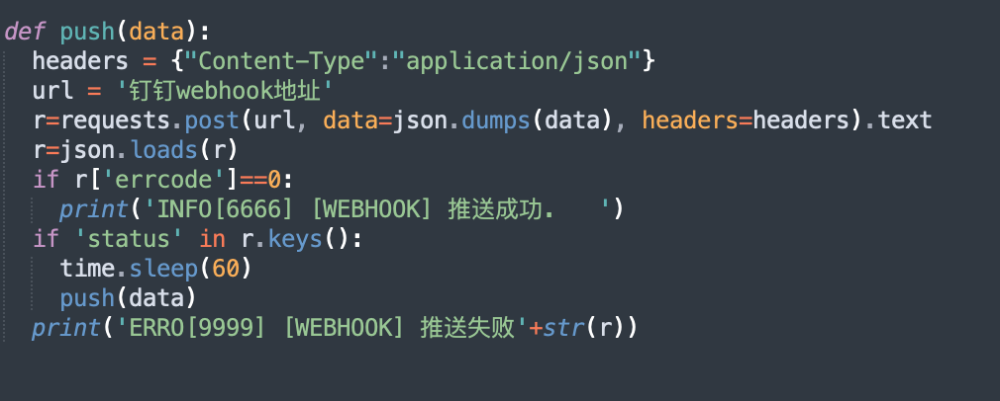

# SimpleHoneypot
依赖：

- linux
- python3
- requests

基于Fapro的简易的Honeypot

直接将faPro的日志解析通过webhook推送到钉钉一个简易的蜜罐就做好了

初步使用下来 感觉还不错 我是直接拿FaPro的日志作为数据分析告警的,如果想获取更多报文信息可以使用tcpdump作为数据源。

dingding Webhook 使用见

https://developers.dingtalk.com/document/robots/custom-robot-access

先配置钉钉webhook

./start.sh

